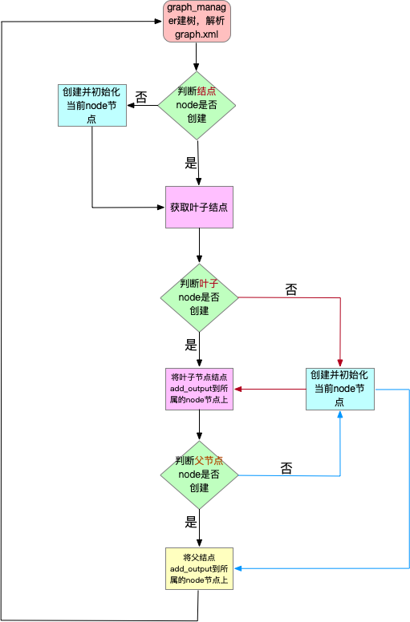

c++常用主键
### dag 框架

-DDAG_SYNCHRONIZE_USE -DDAG_THREAD_USE

1 支持异步、同步、线程、协程调度，默认为异步、协程方式调度

2 如果graph中，如果有节点在root中的叶子结点找不到，那么该节点将不会执行。但会被创建

3 层序遍历root节点，存储所有节点

4 每次请求，将当前node节点带有状态存储。之后从root节点开始run执行

### dag后续优化
1 每个node节点增加超时控制
